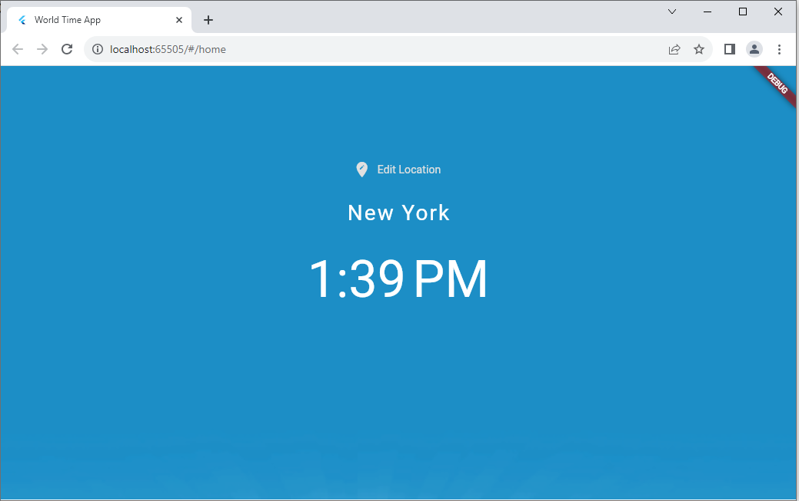
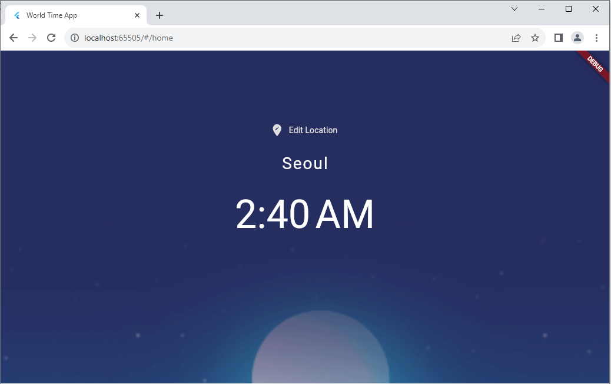
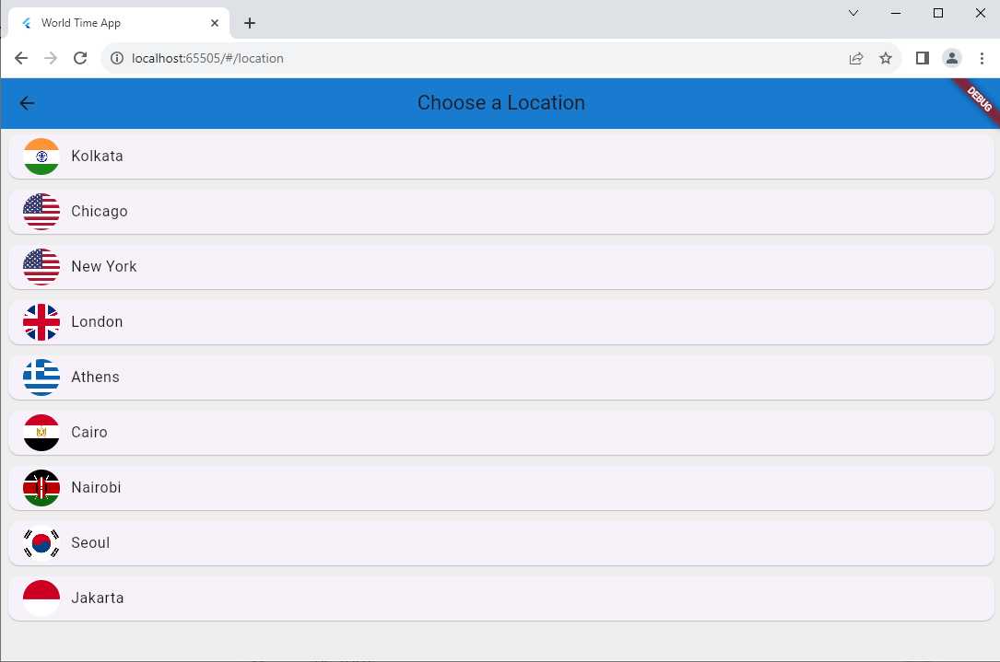

# Flutter World Time App

A simple web/mobile (Android) application to view the World Time, implemented using Flutter. This
application was developed using the basic concepts of Flutter and the Dart programming language.

## Table of Contents

1. [Getting Started](#getting-started)
    - [Prerequisites](#prerequisites)
    - [Installation](#installation)
2. [Usage](#usage)
3. [Contributing](#contributing)
4. [Contact](#contact)
5. [Credits](#credits)


## Getting Started

These instructions will help you set up and run the Flutter application locally on your device.

### Prerequisites

- **Flutter SDK:** Make sure you have Flutter installed on your system. You can follow the
  instructions [here](https://flutter.dev/docs/get-started/install) to install Flutter.
- **IDE:** Choose an IDE for Flutter development. Popular choices include Android Studio, Visual
  Studio Code, and IntelliJ IDEA.
- **Git:** Make sure you have [Git](https://git-scm.com/) installed on your device to clone the
  repository. (This step is optional, in case you are downloading the ZIP file or not contributing
  to the repository).

### Installation

**1. Clone the repository.**

Open your terminal or command prompt and navigate to the directory where you want to clone the
repository. Then, run the following command:

```bash
git clone <https://github.com/NehangPatel23/world_time_app.git>
```

<br>

**2. Navigate to the project directory.**

Once you have cloned the directory, navigate to the directory of the Flutter project using
the ```cd``` command:

```bash
cd world_time_app
```

<br>

**3. Install the Flutter SDK.**

- If you haven't installed Flutter SDK yet, download it from the
  official [Flutter website](https://docs.flutter.dev/get-started/install).
- Extract the downloaded ZIP file to a location on your computer.
- Add the ```flutter/bin``` directory to your system's PATH to access the Flutter commands globally.

<br>

**4. Install the dependencies.**

Flutter projects have certain dependencies that need to be installed before the application can be
run. In the project directory, run the following command to install the dependencies specified in
the ```pubspec.yaml``` file:

```bash
flutter pub get
```

<br>

**5. Open the project in your IDE.**

Open your chosen IDE and open the project directory. You can install the Flutter and Dart extensions
for a smoother development experience.
For example, if you're using Visual Studio Code, you can open the project by running:

```bash
code .
```

<br>

**6. Connect a physical device or start an emulator.**

- Ensure that you have either a physical device connected via USB debugging or an emulator running.
- **For Android:** Start an Android emulator or connect an Android device.
- **For Web:** Start an Web simulator from the "Manage Devices" tab.

<br>

**7. Run the application.**

Run the following command to build and launch the app on your connected device or emulator:

```bash
flutter run
```

<br>

**Additional Setup**

- If your project uses Firebase or other external services, you might need to set up configurations
  locally. Refer to the respective documentation for instructions.
- For web support, enable web in your Flutter project using:

    ```bash
    flutter config --enable-web
    ```
  Then run the app with Chrome, for example, as the target device:

    ```bash
    flutter run -d chrome
    ```

This comprehensive step-by-step guide should help you set up and run this Flutter project locally,
including options for both Android emulation and web development. If you encounter any issues, feel
free to ask for further assistance!

## Usage

Using this application is quite starightforward. Once you launch the application on your emulator or
web, you will see a screen similar to the following:




The light blue background in the first image shows that it is day time in New York, whereas the dark
blue background for Seoul shows that it is night there.

On clicking the **'Edit Location'** button, you should be able to see a list of place for which the
local time is available:



Clicking on the **'Back'** button on the top-left corner in the blue app bar should take you back to
the last place you viewed the time for, which in my case, would be Seoul.

That's all! That is how you would use this app.

***Note:*** This application uses a third-party API,
called [WorldTimeAPI](https://worldtimeapi.org/) to get the current time of a place. More
information about the API can be found [here](https://worldtimeapi.org/pages/faqs).
<br>

## Contributing

Contributions are welcome! If you'd like to contribute to this project, feel free to fork the
repository and submit a pull request with your changes. Please adhere to the following guidelines:

- Describe your changes in detail and provide a clear explanation of the problem you're solving.
- Make sure your code follows the project's coding style and conventions.
- Test your changes thoroughly to ensure they don't introduce any new issues.

## Contact

If you have any questions, feedback, or suggestions regarding this project, please feel free to
contact me via email at patel3ng@mail.uc.edu.

## Credits

This project was developed following the tutorial
series [Flutter Tutorial for Beginners](https://www.youtube.com/playlist?list=PL4cUxeGkcC9jLYyp2Aoh6hcWuxFDX6PBJ)
by [The Net Ninja](https://www.thenetninja.co.uk/).

Special thanks to [The Net Ninja](https://www.thenetninja.co.uk/) for providing such a comprehensive
and helpful tutorial series on building Flutter apps.
